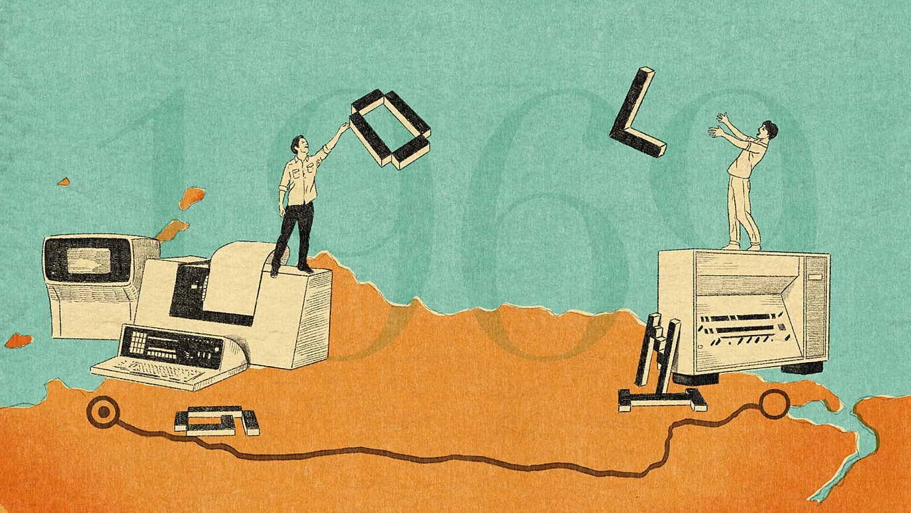
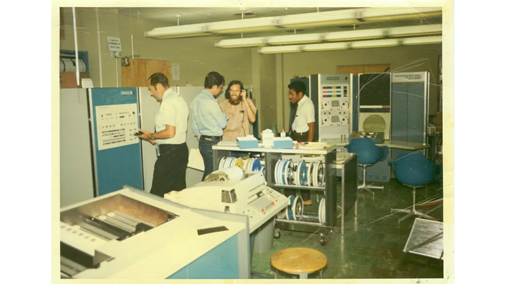

# My Portofolio

## About Me

- **Name: Athallah Raja Mustafa**
- **Student ID: 2802537552**
- **Class: B4CC**

## Article: A Failure That Started The Internet

**Source:** BBC Future - [The Failure That Started the Internet](https://www.bbc.com/future/article/20241028-the-failure-that-started-the-internet)  
**Date:** October 28, 2024

### Summary
On October 29, 1969, Charley Kline (UCLA) and Bill Duvall (Stanford Research Institute) attempted to send the first message over ARPANET, the precursor to the modern internet. Kline tried to type "LOGIN" to connect to Duvall's system 350 miles away, but the system crashed after only two letters - "L-O". The crash occurred because the network was much faster than expected (5,000 characters per second vs the usual 10), which overloaded the input buffer like "filling a glass with a fire hose." They fixed the issue within an hour by adjusting the buffer size. Neither scientist realized the historic significance at the time - they were simply trying to get it to work. This "failed" first message became the foundation for the internet that now connects billions of people worldwide.

*The first internet message: just "L-O"*

### Key Takeaways

- **The First Message**: The first internet transmission was just two letters "L-O" on October 29, 1969, between UCLA and Stanford Research Institute
- **Packet Switching Technology**: ARPANET used packet switching instead of telephone lines, which became the foundation for modern internet data delivery
- **Learning from Failure**: The crash taught engineers about buffer management and network speed handling - critical lessons for internet development
- **Unexpected Speed**: The network was 500x faster than existing systems, causing unforeseen problems that led to important improvements
- **Humble Beginnings**: The computers were refrigerator-sized but millions of times less powerful than a modern Apple Watch
- **Modern Concerns**: The creators worry about misinformation, loss of privacy, corporate domination, and the lack of preparation for AI's impact on society
- **Openness vs Control**: The internet's open nature enabled innovation (online shopping, streaming, social media) but also created security vulnerabilities

*ARPANET network by December 1969*
